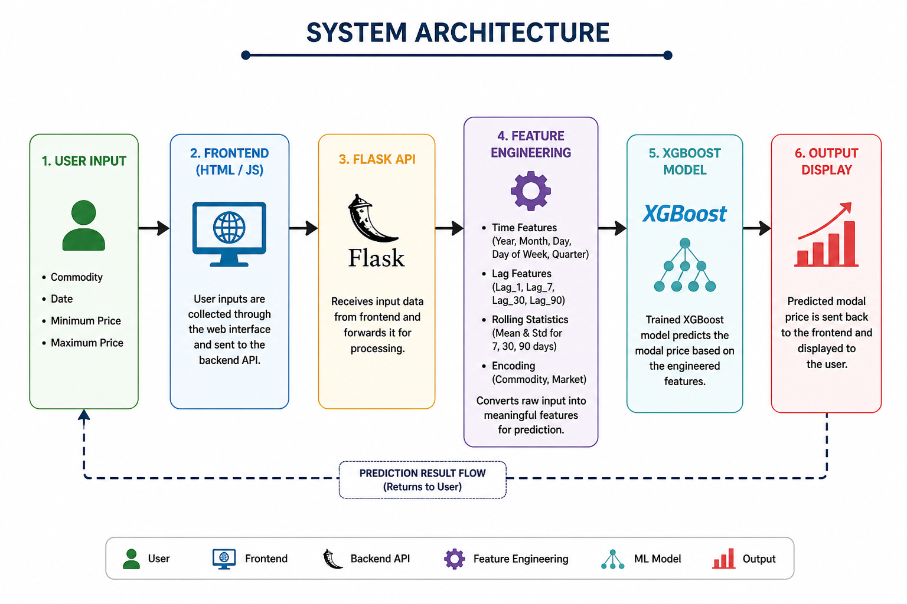
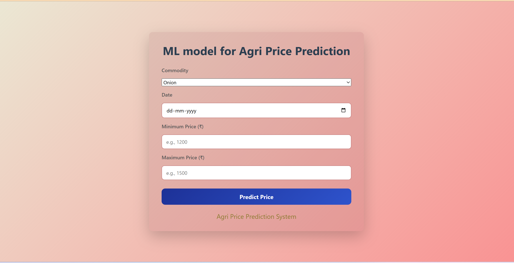
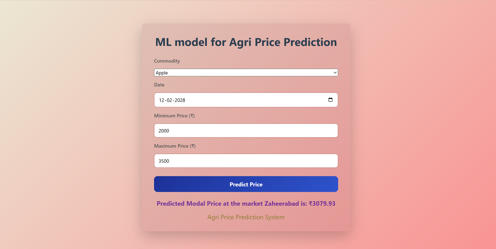
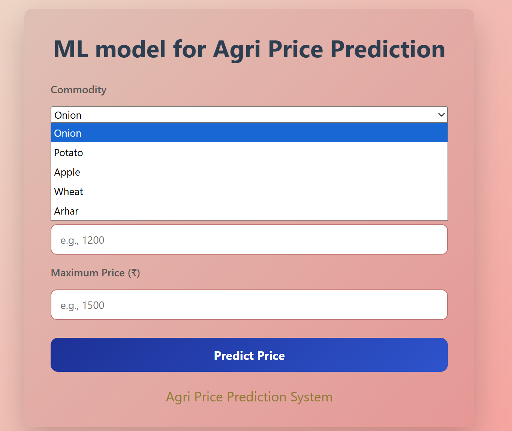

# 🌾 AI-ML Based Agricultural Commodity Price Prediction

## 📌 Overview

Agricultural commodity prices fluctuate due to market demand, seasonal variations, and other economic factors. Farmers and traders often face difficulties in estimating future prices, which can affect decision-making and profitability.

This project presents an AI and Machine Learning based Agricultural Commodity Price Prediction System that predicts the future modal price of agricultural commodities using historical market data and machine learning techniques.

The system uses an XGBoost Regression model trained on historical commodity price datasets and provides predictions through a user-friendly web interface developed using Flask, HTML, CSS, and JavaScript.

---

## 🎯 Objectives

- Predict future agricultural commodity prices using Machine Learning.
- Assist farmers and traders in making informed decisions.
- Analyze historical market trends and patterns.
- Develop an end-to-end machine learning application with a web-based interface.

---

## ✨ Features

- Commodity selection for prediction.
- Historical data-based feature engineering.
- XGBoost Machine Learning model.
- Flask backend API.
- Interactive and responsive web interface.
- Real-time prediction generation.
- Market-wise prediction support.
- User-friendly design.

---

## 🛠️ Technology Stack

### Machine Learning
- Python
- XGBoost Regressor
- Scikit-Learn
- Pandas
- NumPy

### Backend
- Flask

### Frontend
- HTML
- CSS
- JavaScript

### Tools
- Jupyter Notebook
- VS Code
- Git
- GitHub

---

## 🏗️ System Architecture

The overall workflow of the system is:

```text
User Input
     ↓
Frontend (HTML/CSS/JavaScript)
     ↓
Flask Backend API
     ↓
Feature Engineering
     ↓
XGBoost Prediction Model
     ↓
Predicted Commodity Price
```

### Architecture Diagram



---

## 📊 Machine Learning Workflow

### Data Collection

Historical commodity price datasets were collected and merged into a unified dataset.

### Data Preprocessing

- Missing value handling
- Feature selection
- Date feature extraction
- Label Encoding
- Data Scaling

### Feature Engineering

The following features were generated:

- Lag 1
- Lag 7
- Lag 30
- Lag 90
- Rolling Mean (7, 30, 90)
- Rolling Standard Deviation (7, 30, 90)
- Commodity Encoding
- Date-Based Features

### Model Training

The model was trained using:

- XGBoost Regressor

### Model Evaluation

Performance Metrics:

| Metric | Value |
|----------|----------|
| MAE | 57.27 ₹/quintal |
| RMSE | 95.15 ₹/quintal |
| MAPE | 2.62% |

These results indicate that the model can predict agricultural commodity prices with relatively low percentage error.

---

## 🖥️ Application Screenshots

### Homepage



### Prediction Interface



### User Interface



---

## 📂 Project Structure

```text
AI-ML-Based-Agri-Commodity-Price-Prediction
│
├── backend
│   ├── app.py
│   ├── templates
│   ├── static
│
├── model
│   ├── train_model.ipynb
│   ├── price_model.pkl
│   ├── scaler.pkl
│
├── screenshots
│
├── README.md
└── .gitignore
```

---

## 🚀 How to Run the Project

### 1. Clone Repository

```bash
git clone https://github.com/Vineesh-Vellanki-0106/AI-ML-Based-Agri-Commodity-Price-Prediction.git
```

### 2. Install Dependencies

```bash
pip install flask pandas numpy scikit-learn xgboost joblib
```

### 3. Run Flask Application

```bash
python app.py
```

### 4. Open Browser

```text
http://127.0.0.1:5000
```

---

## 📈 Future Enhancements

- Support additional commodities.
- Integrate real-time market data APIs.
- Deploy the application on cloud platforms.
- Add graphical trend visualizations.
- Improve prediction accuracy with larger datasets.
- Develop a mobile application version.

---


## 🏛️ Academic Information

Mini Project submitted as part of the Bachelor of Technology (B.Tech) curriculum.


---

## 📄 License

This project is developed for academic and educational purposes.

---

## ⭐ Acknowledgement

This project was developed to explore the practical application of Artificial Intelligence and Machine Learning in agriculture and commodity price forecasting.
